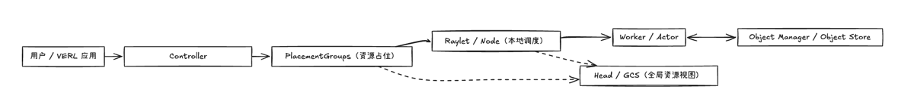
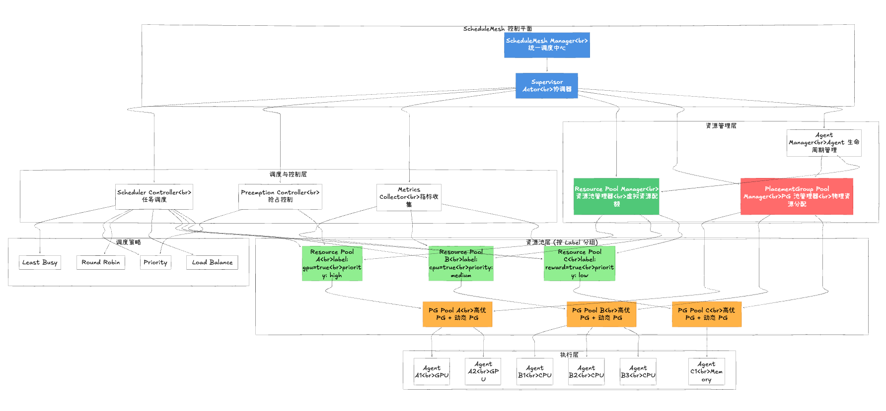

# ScheduleMesh 设计文档

---

## 一、背景

### 1.1 Ray 现状

- **Actor 缺乏统一管理**
- **PlacementGroup 静态不可扩缩**
- **缺乏全局调度反馈机制**
- **集群内部不支持优先级和抢占**

### 1.2 Ray 原有架构

Ray 的现有架构遵循 Head Node 统一调度、Worker Node 执行的模式：Head Node 内的 GCS 维护集群拓扑与对象元信息，调度器根据资源心跳把任务派发给对应的 Worker Node，Autoscaler 则依据 GCS 中的资源利用率扩缩节点规模。每个 Worker Node 运行 Raylet，负责上报资源、执行任务和对象存取，节点之间通过对象存储与消息通道共享数据。

---

## 二、问题

| 类别 | 问题描述 | 影响 |
|------|------------|------|
| 调度层 | 缺乏 label / 优先级调度能力 | 无法精准匹配资源 |
| 资源层 | PlacementGroup 不支持动态扩缩 | 弹性不足、任务卡顿 |
| 控制层 | 缺少全局调度反馈 | Manager 无法优化决策 |
| 执行层 | 无抢占机制 | 高优任务延迟 |
| 观测层 | 缺乏 metrics 聚合 | 调度状态不可见 |

---

## 三、目标

### 3.1 目标

- 构建统一调度与资源管控平面（**ScheduleMesh**）  
- 支持 **label-based scheduling** 与资源域隔离  
- 支持 **高优抢占与任务重调度**  
- 实现 **异步 metrics 汇聚与全局优化**  
- 支持 **层级化调度（multiple Mesh）**

### 3.2 核心功能支持

#### 1️⃣ 计算图定义（DAG / Actor）
- 支持 `@ray.remote` 定义 Actor/Task  
- DAG 拆分与依赖跟踪  
- 统一任务提交接口

#### 2️⃣ 资源管理
- 统一资源视图与动态扩缩  
- PlacementGroup 动态管理  
- Label-based scheduling  

#### 3️⃣ 调度与执行
- 多策略调度（least_busy / priority）  
- 优先级抢占与故障恢复  
- 负载均衡优化  

#### 4️⃣ 统一监控与 Metrics 收集
- Agent 内部 metrics 收集  
- 指标聚合与可视化  
- 调度事件追踪  

---

## 四、设计

### 4.1 架构概览

- **ScheduleMesh**：全局调度与资源管控中心  
- **Resource Pools**：资源池管理器，按 pool 维度记录容量、已用配额与目标 Agent 数量（替代早期的「Broker」概念）  
- **PlacementGroup Pool Manager**：PlacementGroup 池化管理器，支持高优 PG 预留与动态 PG 管理  
- **Agent Actor**：执行计算任务并异步收集 metrics  

> 架构核心：基于"mesh"形状的 actor 组，支持多维度分片（pipeline parallel、tensor parallel、sequence parallel）

**三种调用方式：**

| 调用方式 | 说明 |
|-----------|------|
| `.all()` | 在所有 actor 上执行相同方法 |
| `.choose()` | 负载均衡选择单个 actor 执行 |
| `.shard()` | 集体操作，支持自定义分片策略（workersN → workersB） |

**统一调度逻辑：**
- ScheduleMesh 负责全局调度与 Resource Pools 管理  
- Resource Pools 管理虚拟资源配额（容量、已用、预留）  
- PlacementGroup Pool Manager 管理物理资源分配（PG 创建、分配、复用）  
- 数据流通过 `ObjectRef` 和 `ActorHandle` 机制传输  

### 4.2 核心角色

| 角色 | 职责 |
|------|------|
| **ScheduleMesh** | 全局调度中心，负责任务分发与资源协调 |
| **Resource Pools** | 资源池管理器，按 pool 维度管理容量、已用配额与目标 Agent 数量，替代早期的「Broker」概念 |
| **PlacementGroup Pool Manager** | PlacementGroup 池化管理器，支持高优 PG 预留、动态 PG 创建与 PG 复用，实现高优作业快速启动 |
| **Agent Actor** | 执行具体计算任务，异步收集任务执行 metrics |

---

## 五、模块设计

| 模块 | 职责说明 | 核心接口 / 功能 | 备注 |
|------|------------|----------------|------|
| **① ScheduleMesh API** | actor 组抽象 | `.all()`, `.choose()`, `.shard()` | 三种调用方式 |
| **② Resource Registry** | 管理 Resource Pools、PG、Actor 元信息 | `list_pools()`, `list_agents()` | 统一资源视图 |
| **③ Scheduler** | 决定任务派发目标 | `.choose(label, strategy)`, `.all(label)` | 支持 least_busy / random / priority |
| **④ Resource Pool Manager** | Resource Pool 生命周期管理 | `.create_pool()`, `reserve_agent_slot()`, `commit_agent_slot()` | 管理虚拟资源配额（容量、已用、预留） |
| **⑤ PlacementGroup Pool Manager** | PlacementGroup 池化管理 | `.configure_pool()`, `.allocate_pg()`, `.release_pg()` | 高优 PG 预留、动态 PG 创建、PG 复用 |
| **⑥ Agent Manager** | Agent 生命周期管理与 metrics 收集 | `.create_agent()`, `.create_agent_with_pg()`, `.collect_metrics()` | 集成 metrics 收集，支持 PG 池分配 |
| **⑦ Preemption Controller** | 抢占逻辑控制 | `.evaluate_preemption()`, `.execute_preemption()` | 高优先级抢占，与 PG 池配合实现快速抢占 |

### 5.1 Scheduler 算法与抢占策略

- **多级标签队列**：每个 `label`（例如 `gpu:a100`、`tenant:gold`）关联一条优先级队列；任务入队时计算  
  `WorkloadPriority = P_label + P_base + aging_factor × wait_time`，其中 `P_label` 由租户 SLA 或资源域配置给定，`aging_factor` 防止长尾饥饿。
- **候选资源打分**：对符合 label 约束的 ResourceManager/Agent 计算  

  ```
  score = α · availability − β · fragmentation + γ · locality − δ · contention
  ```

  系数 `α~δ` 支持按 label 或 workload 类型配置，以平衡资源利用率与数据亲和。
- **调度流程**：
  1. 全局优先队列弹出最高 `WorkloadPriority` 的任务；
  2. 根据 label/约束过滤可调度资源集合；
  3. 采用打分函数选择最优节点，若存在并发冲突则依靠乐观锁或重试机制；
  4. 若无可用节点且允许抢占，则调用 Preemption Controller 评估可抢占任务。
- **抢占判定**：对候选低优任务计算 `preempt_score = Δpriority − κ × remaining_time`，超过阈值即触发抢占。优先在同 label 内回收资源，跨 label 抢占受隔离策略保护。
- **可插拔策略**：调度器暴露 `score()`、`priority()`、`preemption_policy()` 的接口，支持以插件/WASM 自定义，默认提供 `least_busy`、`binpacking`、`priority` 等组合策略。
- **并发与一致性**：调度决策写入全局事务日志（或乐观版本号）后才下发执行，失败重试会回滚队列顺序避免任务丢失。

---

## 六、核心流程（Flow）

### 6.0 架构总览图


**架构说明：**
- **ScheduleMesh Manager** 通过 **Supervisor Actor** 统一协调所有组件
- **Resource Pool Manager** 管理虚拟资源配额（容量、已用、预留），替代早期的「Broker」概念
- **PlacementGroup Pool Manager** 管理物理资源分配（PG 创建、分配、复用），支持高优作业快速启动
- **Resource Pools** 按 label 分组，每个 Pool 对应一个 **PG Pool**（高优 PG + 动态 PG）
- **Agent Manager** 同时协调 Resource Pool 和 PG Pool，确保虚拟配额与物理资源一致
- **Preemption Controller** 与 PG Pool 配合，实现快速抢占（保留 PG 供复用）

### 6.1 任务调度流程

1. **`.all()`**  
   - 在所有 actor 上执行相同方法  
   - 基于 actor rank 运行不同代码  

2. **`.choose()`**  
   - 负载均衡选择单个 actor 执行  
   - 支持 *power-of-two* 调度  

3. **`.shard()`**  
   - 集体操作  
   - 通过 `dispatch_fn` 自定义数据分片策略  

---

### 6.2 Metrics 反馈流程
Agent 周期性（默认 5 秒）推送本地资源利用率、任务排队时长、失败重试次数等指标；ScheduleMesh 在控制平面聚合后进行异常检测与回归分析，并将优化后的调度权重/优先级同步回 Scheduler 与 ResourceManager，形成闭环。

| 指标 | 说明 | 采样频率 | 目标阈值 |
|------|------|-----------|-----------|
| `schedule_latency_p95` | P95 调度决策耗时（提交→绑定） | 5 s 聚合 | ≤ 200 ms |
| `queue_wait_time_p99{tier}` | 分优先级的 P99 排队时长 | 5 s 聚合 | 高优 ≤ 1 s，标准 ≤ 10 s |
| `placement_success_rate` | 单次调度成功率（无需重试） | 1 min 滑窗 | ≥ 99% |
| `preemption_count{label}` | 各 label 每分钟抢占次数 | 1 min 滑窗 | 限制在策略设定范围 |
| `resource_fragmentation` | 剩余资源碎片化指数 | 30 s 聚合 | 相比基线降低 ≥ 25% |
| `agent_heartbeat_gap` | Agent 最大心跳间隔 | 5 s 聚合 | 连续异常触发告警 |

指标通过 Prometheus/OpenTelemetry 采集，并触发自动化调参：例如当 `schedule_latency_p95` 超阈时动态扩容 Scheduler 副本或调整 `α/β` 系数；`preemption_count` 超限则降低跨 label 抢占权重。

### 6.3 抢占流程
高优任务到达时，Preemption 模块会筛选目标资源域内正在运行的低优任务，按照优先级与剩余执行时间进行评分，挑选可抢占对象并发起终止；释放资源后，Scheduler 立即为高优任务执行重调度，保证关键 SLA。

#### 6.3.1 Kill 低优任务实现
在 API 层面定义 `cancel()` 方法，提供两级持久化策略：
- **默认策略**：框架自动保存任务上下文快照（输入参数、执行进度、最近一次 checkpoint），由中心化存储维护生命周期，保证任务可在恢复时直接拉取状态并重新执行。
- **自定义策略**：用户可注入自定义 `state_preserver()` 与配对的 `state_restorer()`，在 `cancel()` 时执行特定的序列化逻辑（例如写入自建存储、筛选必要状态字段），恢复阶段通过 `state_restorer()` 回放；若自定义函数失败则回退到默认策略。

自定义函数约定如下：

```python
@schedule_mesh.register_state_handlers(
    preserver=lambda ctx: SavedState(payload=serialize(ctx.actor_state)),
    restorer=lambda ctx, saved: apply_state(ctx.actor_ref, deserialize(saved.payload)),
)
```

- `preserver(ctx: CancelContext) -> SavedState`：接受框架提供的 `CancelContext`（包含 Actor 标识、任务参数、最新 checkpoint 元数据），返回自定义序列化结果。
- `restorer(ctx: RestoreContext, saved: SavedState) -> None`：在任务恢复阶段调用，负责将持久化状态应用到目标 Actor/任务实例。
- 两个函数都必须是幂等的，并在异常时抛出可识别错误，框架会记录失败并切回默认快照策略。

### 6.4 PlacementGroup 池化管理流程

PlacementGroup Pool Manager 为每个 Resource Pool 维护一个 PG 池，实现高优作业的快速启动与资源隔离。

#### 6.4.1 PG 池结构

每个 Pool 的 PG 池包含两层：
- **高优 PG 层**：预创建的预留 PG，专门供高优任务（priority >= 8.0）使用，确保零等待启动
- **动态 PG 层**：按需创建的普通 PG，支持复用与动态扩缩

#### 6.4.2 PG 分配策略

当 Agent 需要创建时，PG 分配遵循以下优先级策略：

1. **高优任务优先使用预留 PG**（priority >= 8.0）
   - 优先从高优 PG 池中分配匹配规格的 PG
   - 若匹配成功，立即分配给 Agent，实现零等待启动

2. **尝试复用已有空闲 PG**
   - 检查动态 PG 池中是否有规格匹配且未分配的 PG
   - 若存在，复用该 PG（降低创建开销，提高资源利用率）

3. **动态创建新 PG**
   - 若无可复用 PG 且允许动态创建，创建新的动态 PG
   - 受 `max_dynamic_pgs` 限制，防止资源过度占用

#### 6.4.3 PG 复用机制

- PG 释放时，默认保留在池中供复用（`destroy=False`）
- 复用次数记录在 `PGRecord.reuse_count` 中，用于监控与优化
- 可通过 `release_pg(destroy=True)` 强制销毁 PG，释放底层资源

#### 6.4.4 与 Resource Pool 的协作

- **Resource Pool**：管理虚拟资源配额（容量、已用、预留），确保资源账本一致性
- **PG Pool**：管理物理资源分配（PG 创建、分配、复用），保证资源隔离与快速启动
- **协作流程**：
  1. Agent 创建时，先通过 Resource Pool 预留虚拟配额
  2. 从 PG Pool 分配物理 PG（遵循上述分配策略）
  3. 使用 PG 创建 Ray Actor
  4. 提交虚拟配额使用（commit）
  5. Agent 删除时，释放 PG（保留复用）并释放虚拟配额

#### 6.4.5 高优作业管理

通过 PG 池的优先级分层，实现高优作业的快速启动：

- **预创建阶段**：在 Pool 配置时，可指定 `high_priority_pg_specs`，预创建高优 PG
- **分配阶段**：高优任务（priority >= 8.0）优先使用预留 PG，避免创建延迟
- **抢占阶段**：与 PreemptionController 配合，抢占时保留 PG 供快速复用，实现快速抢占与恢复

### 6.5 任务提交流程（PG 池模式）

使用 PG 池模式的任务提交流程（`submit_task_with_pg_preemption`）：

1. **参数校验**：验证 `pool_name`、`resources`、`actor_class`、`task_id` 等必需参数
2. **PG 分配尝试**：调用 `AgentManager.create_agent_with_pg()`，PG Pool Manager 执行分配策略
3. **成功路径**：若 PG 分配成功，创建 Agent 并完成资源池配额提交与调度器注册
4. **抢占路径**：若 PG 分配失败（资源不足），触发抢占流程：
   - 评估可抢占候选任务
   - 执行任务级抢占（保存状态、清理记录）
   - 删除被抢占 Agent 但保留其 PG（`destroy_pg=False`）供快速复用
   - 再次尝试 PG 分配（应能复用刚释放的 PG）
5. **状态一致性**：确保 Resource Pool 配额、PG 分配、调度器注册三者一致

### 6.6 Resource Pool 与 PG Pool 的职责划分

| 维度 | Resource Pool Manager | PlacementGroup Pool Manager |
|------|----------------------|----------------------------|
| **管理对象** | 虚拟资源配额 | 物理资源分配（PG） |
| **管理内容** | 容量、已用、预留配额 | PG 创建、分配、复用、销毁 |
| **粒度** | Pool 级别 | Pool 级别 + PG 级别 |
| **职责** | 资源账本管理、配额预留/提交/释放 | 资源隔离、高优保障、快速启动 |
| **协作** | 保证配额一致性 | 保证物理资源可用性 |

两个管理器相互配合，实现虚拟配额与物理资源的双重保障：
- Resource Pool 确保资源账本正确，防止超分配
- PG Pool 确保物理资源隔离，支持高优作业快速启动
